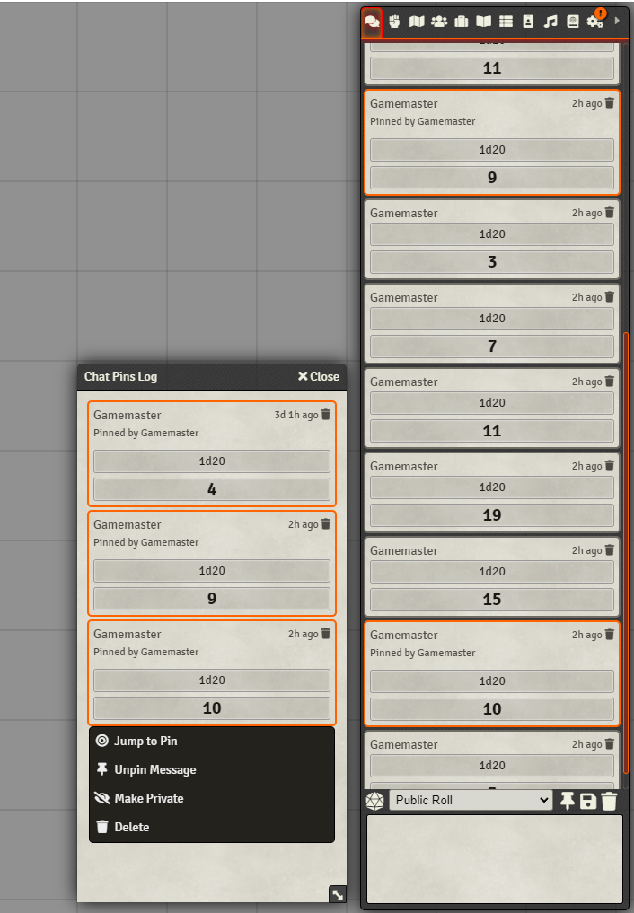

  

<h1 align="center">DFreds Chat Pins</h1>

<h4 align="center">
  <a href="https://foundryvtt.com/packages/dfreds-chat-pins">Install</a>
  ·
  <a href="https://discord.gg/Wq8AEV9bWb">Discord</a>
  ·
  <a href="https://github.com/topics/dfreds-modules">Other Modules</a>
</h4>

    
    
    
     
     
    
    
     
    
    
     
     
    
    
    

    <b>DFreds Chat Pins</b> is a FoundryVTT module that allows pinning messages to the chat.

## Let Me Sell You This

Have you ever wanted to save a specific message, but delete all those other
crappy ones? What if you want to refer to it later? That sounds like a lot of
scrolling. Lame.

## What This Module Does

This module allows you to right-click any message in the chat log and pin or
unpin it. This stops Foundry from deleting it when you flush the chat log.

Additionally, you can refer to any of the pinned messages using the handy Chat
Pin Log application by clicking the pin icon above the chat text box.
Right-clicking any of the pinned chats in this chat log will provide an
additional option to jump to it in the main chat log.

## Required Modules

- [libWrapper](https://foundryvtt.com/packages/lib-wrapper) by ruipin - A
  library that wraps core Foundry methods to make it easier for modules
  developers to do their thang. Note that if you for some reason don't want to
  install this, a shim will be used instead. You'll be pestered to install it
  though so... [just do it](https://www.youtube.com/watch?v=ZXsQAXx_ao0)
